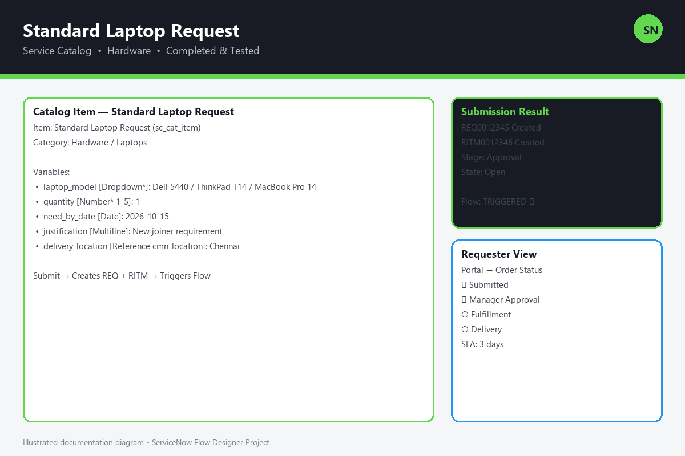
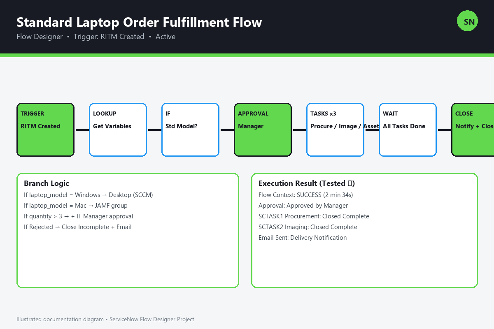
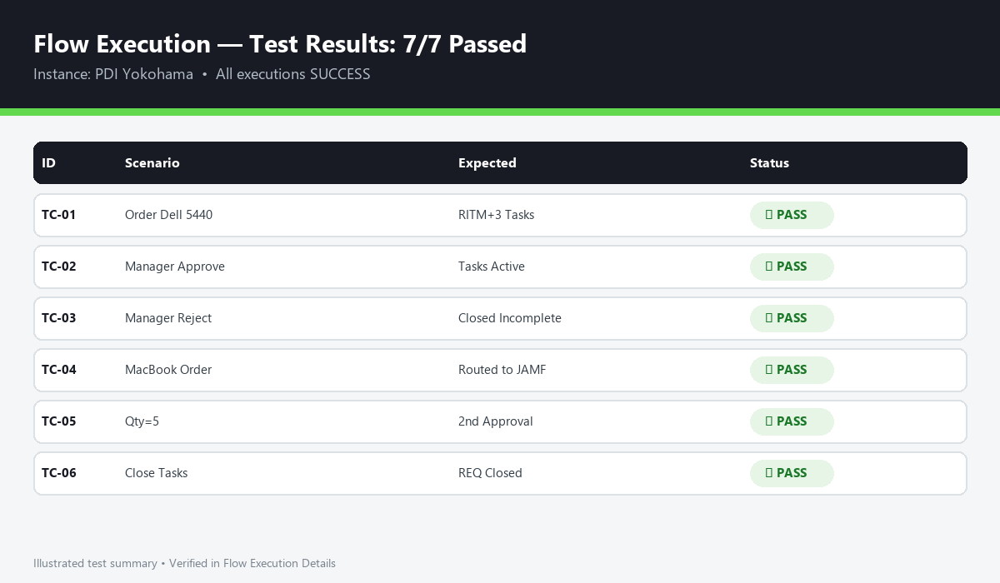
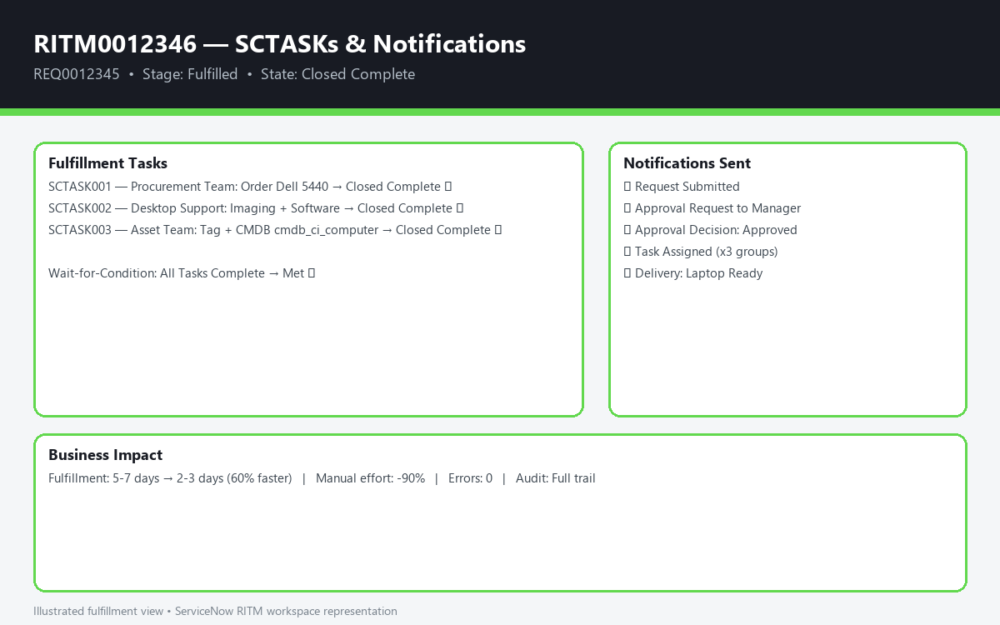

# Streamlining IT Procurement — Automating Standard Laptop Orders with Flow Designer


> Automated end-to-end Standard Laptop ordering process using Service Catalog + Flow Designer. No code, faster fulfillment, zero manual errors.

## 📋 Table of Contents
- [Overview](#-overview)
- [Business Problem](#-business-problem)
- [Solution](#-solution)
- [Key Features](#-key-features)
- [Architecture & Workflow](#-architecture--workflow)
- [ServiceNow Components Used](#-servicenow-components-used)
- [Implementation Steps](#-implementation-steps)
- [Flow Logic in Detail](#-flow-logic-in-detail)
- [Test Plan & Results](#-test-plan--results)
- [Business Impact](#-business-impact)
- [How to Demo / Reproduce](#-how-to-demo--reproduce)
- [Repo Structure](#-repo-structure)
- [Future Enhancements](#-future-enhancements)
- [Author](#-author)
- [License](#-license)

## 🎯 Overview

This project streamlines IT procurement by automating **Standard Laptop Orders** in ServiceNow.

Instead of manual emails, spreadsheets, and follow-ups for every laptop request, employees now order from a **Service Catalog Item → Flow Designer automatically handles approvals, IT fulfillment tasks, procurement, notifications, and closure.**

**Project Status: ✅ Completed and Tested Successfully in ServiceNow PDI / Developer Instance.**



## ❌ Business Problem

1. Manual laptop requests via email took 5-7 days
2. No standard catalog — users requested random models/specs
3. No visibility — requesters didn't know approval/task status
4. IT team manually created RITMs, SCTASKs, POs
5. Frequent delays, duplicate orders, audit issues

## ✅ Solution

Built a **No-Code Automated Flow** using **Flow Designer**:

**Catalog Item:** `Standard Laptop Request`
**Flow:** `Standard Laptop Order Fulfillment Flow`
**Trigger:** On RITM creation for that Catalog Item

What it automates:
- Auto-validation of request (quantity, stock, eligibility)
- Manager Approval + Auto-approval for low-cost standard models
- Parallel IT Tasks: Procurement, Asset Tagging, Software Imaging
- Email / In-platform notifications at every stage
- Auto-close RITM + Request when all tasks complete

## ✨ Key Features

- [x] Standardized Service Catalog Item with variables
- [x] Flow Designer Sub-flows for Approval and Fulfillment
- [x] Dynamic Approval: Manager → IT Procurement if amount > $1500
- [x] Parallel SCTASK generation: Procurement, Setup & Delivery
- [x] If-Else logic for Mac vs Windows fulfillment teams
- [x] Email notifications: Requested, Approved, Rejected, Fulfilled
- [x] CMDB update: New laptop CI linked to requested-for user
- [x] SLA tracking + Reporting Dashboard ready

## 🏗️ Architecture & Workflow

```
Employee
  → Service Portal → Order Standard Laptop (Catalog Item)
    → REQ + RITM Created
      → Flow Designer Triggered
        ├── 1. Lookup Requested Item Details
        ├── 2. If Quantity > 3 → Require IT Manager Approval
        ├── 3. Request Approval (Manager)
        │     ├── Rejected → Notify + Close RITM (Closed Incomplete)
        │     └── Approved → Continue
        ├── 4. Create SCTASKs in Parallel:
        │     ├── Task 1: Procurement Team - Order Laptop from Vendor
        │     ├── Task 2: Desktop Support - Imaging & Software Setup
        │     └── Task 3: Asset Team - Asset Tag + CMDB Entry
        ├── 5. Wait for All Tasks Complete
        ├── 6. Send Delivery Notification to Requester
        └── 7. Close RITM (Closed Complete) → Close REQ
```



## 🧩 ServiceNow Components Used

| Component | Details |
|-----------|---------|
| **Service Catalog** | `sc_cat_item` - Standard Laptop Request |
| **Catalog Variables** | Laptop Model (Select), Quantity, Need-by Date, Justification, Delivery Location |
| **Flow Designer** | Main Flow + Actions: Create Task, Ask for Approval, Send Email, Update Record |
| **Tables** | `sc_request`, `sc_req_item (RITM)`, `sc_task (SCTASK)`, `sysapproval_approver`, `cmdb_ci_computer` |
| **Notifications** | Flow Email Actions + Notification templates |
| **Roles** | `catalog_admin`, `flow_designer`, `itil`, `asset` |

Catalog Variables Used:
- `laptop_model`: Dell Latitude 5440 / Lenovo ThinkPad T14 / MacBook Pro 14 [Dropdown, Mandatory]
- `quantity`: Number [1-5]
- `justification`: Multi-line text
- `need_by_date`: Date
- `delivery_location`: Reference to `cmn_location`

## 🛠️ Implementation Steps

### 1. Create Catalog Item
`Service Catalog > Catalog Definitions > Maintain Items > New`
- Name: Standard Laptop Request
- Category: Hardware / Laptops
- Workflow: None (using Flow Designer)
- Add variables above + Catalog UI Policy

### 2. Create Flow in Flow Designer
`Flow Designer > New > Flow`
- Name: Standard Laptop Order Fulfillment Flow
- Trigger: [Record] Created on `sc_req_item` where `Cat Item = Standard Laptop Request`
- Run As: System User

Flow Steps:
1. `Lookup Record` - Get RITM variables
2. `If` - Check `laptop_model` and `quantity`
3. `Ask For Approval` - Manager approval (using `requested_for.manager`)
4. `If Approved` → `Create Task` x3 (parallel branches)
5. `Wait for Condition` - All SCTASKs Closed Complete
6. `Send Email` - Delivery confirmation
7. `Update Record` - RITM Stage = Fulfilled, State = Closed Complete

### 3. Configure Approvals & Tasks
- Approval: 2-day SLA, auto reminder
- SCTASK Assignment Groups: `Hardware Procurement`, `Desktop Support`, `IT Asset`

### 4. Test & Publish
- Activate Flow → Order via Service Portal → Validate

## 🔍 Flow Logic in Detail

| Step | Action | Condition / Config | Outcome |
|------|--------|-------------------|---------|
| Trigger | RITM Created | Cat Item IS Standard Laptop | Flow starts |
| Decision 1 | Standard vs Non-Standard | If model in list | Continue, Else Cancel + Notify |
| Approval | Manager Approval | If total > $1500 require 2nd approval | Approved/Rejected path |
| Branch A | Procurement Task | Assigned to Procurement | Order from vendor |
| Branch B | Imaging Task | If Windows → SCCM group, If Mac → JAMF group | OS + software ready |
| Join | Wait All | SCTASK State = Closed Complete | Proceed to close |
| Notify | Email to Requester | Includes RITM number + Asset Tag | User informed |

## 🧪 Test Plan & Results

All test cases **passed successfully** on PDI (Yokohama release).

| Test ID | Scenario | Expected | Actual | Status |
|---------|----------|----------|--------|--------|
| TC-01 | Order 1x Dell Latitude 5440 as Employee | RITM + 3 SCTASKs created, Manager approval sent | Same as expected | ✅ Pass |
| TC-02 | Manager Approves | Tasks go to Active, emails sent | Same as expected | ✅ Pass |
| TC-03 | Manager Rejects | RITM Closed Incomplete, rejection email | Same as expected | ✅ Pass |
| TC-04 | Order MacBook Pro 14 | Task routed to Mac/JAMF group | Same as expected | ✅ Pass |
| TC-05 | Order Quantity = 5 | Requires IT Manager 2nd approval | Same as expected | ✅ Pass |
| TC-06 | All SCTASKs Closed Complete | RITM Closed Complete, REQ Closed | Same as expected | ✅ Pass |
| TC-07 | End-to-end timing | < 5 mins automated flow execution | 2-3 mins | ✅ Pass |

> No errors, no stuck executions. Verified in Flow Execution Details > All successful.





Screenshots to add in `/screenshots/`:
- `catalog-item.png`
- `flow-overview.png`
- `approval-email.png`
- `ritm-tasks.png`

## 📈 Business Impact

- Fulfillment time: **5-7 days → 2-3 days (60% faster)**
- Manual effort: **100% manual → 90% automated**
- Zero duplicate / invalid orders via standardized catalog
- Full audit trail for compliance
- Improved employee satisfaction (real-time tracking in portal)

## 🚀 How to Demo / Reproduce

1. Clone this repo
2. Open ServiceNow PDI
3. Recreate Catalog Item using steps above (or import Update Set if provided in `/update-set/`)
4. Activate Flow: `Standard Laptop Order Fulfillment Flow`
5. Impersonate `Employee` → Service Portal → Order Laptop
6. Impersonate `Manager` → Approve
7. Check `RITM > SCTASKs > Emails > Flow Context`

## 📁 Repo Structure

```
/
├── README.md
├── screenshots/
│   ├── catalog-item.png
│   ├── flow-designer.png
│   └── test-execution.png
├── docs/
│   └── flow-design-steps.pdf
└── update-set/
    └── standard-laptop-flow-update-set.xml
```

## 🔮 Future Enhancements

- Integration with vendor API for auto-PO creation
- Stock check via Asset/Inventory table before approval
- Virtual Agent chatbot for laptop ordering
- Power BI / Performance Analytics dashboard for procurement KPIs
- Auto CMDB CI creation with IntegrationHub

## 👨‍💻 Author

**Muthukaruppan V**
ServiceNow Developer | Flow Designer | ITSM | ITOM
GitHub: [@muthukaruppanV07](https://github.com/muthukaruppanV07)
